# LAB Azure - Juan López

## Creación de cuenta
Primero se debe crear (o enlazar) una cuenta de Microsoft Azure
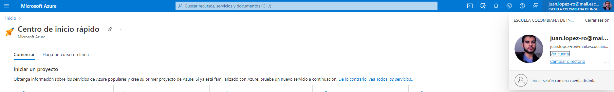

## Prerrequisitos 
Antes de empezar hay que crear una organización de Azure DevOps. Para esto se va al [Portal Azure](https://portal.azure.com/#home), se busca la opción de organizaciones y se da a la opción de gestionar "mis organizaciones", una vez ahí se puede crear una nueva organización:
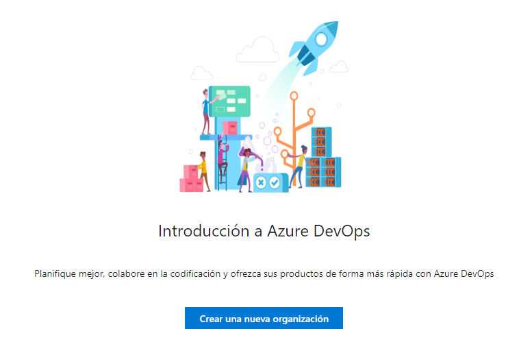

Se ingresa el nombre de la nueva organización, la localidad y un captcha por seguridad:
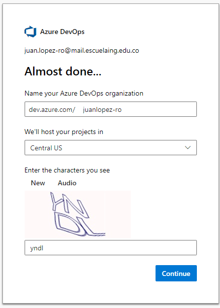

Se debe crear un proyecto de Azure DevOps con contenido suficiente para que el proyecto funcione. Para poder hacer esto se debe ir al link https://azuredevopsdemogenerator.azurewebsites.net y se llega al siguiente sitio:
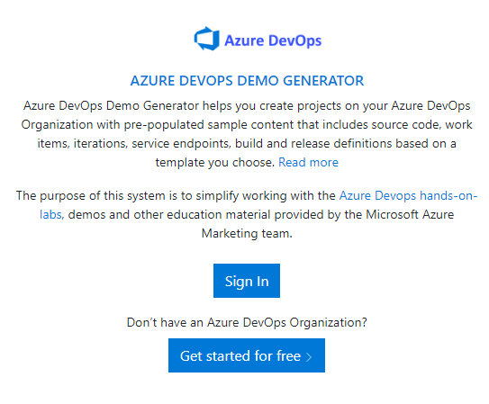

Se da click a "Sign in", se ingresa a la cuenta y se dan los permisos requeridos. Después de esto se llega a la página principal donde se debe ingresar el nombre del proyecto demo ("Parts Unlimited" en este caso), se selecciona la organización creada previamente, el modelo de proyecto Parts Unlimited y se le da click a "Create Project":
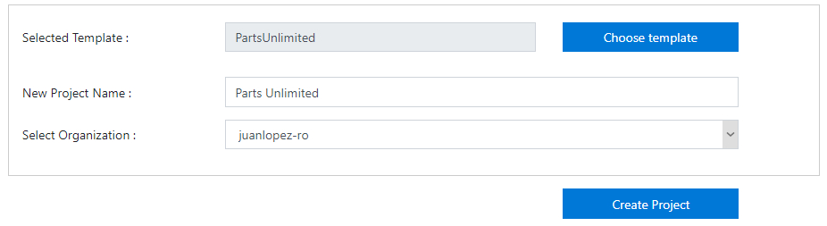

Una vez el proyecto queda creado se puede salir del generador de demos y continuar con el proceso del Laboratorio. Se sabe que el proyecto queda creado cuando sale la siguiente notificación:
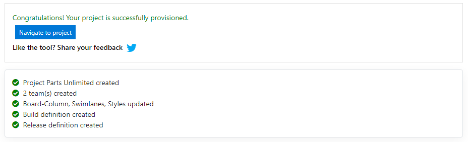

## Creación de los recursos Azure

### Creación base de datos
Llendo al [Portal Azure](https://portal.azure.com/#home) le damos al botón "Crear un recurso" y le damos a crear en la sección de "SQL Database":
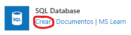

Ya en el menú de creación de la base de datos le damos a crear nuevo grupo de recursos y le ponemos el nombre "partsunlimited":
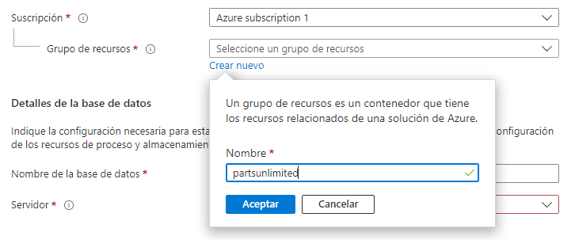

A continuación le ingresamos el nombre a la base de datos ("partsunlimited") y en la sección de servidor le damos a "crear nuevo". En la nueva página ingresamos los siguientes datos del servidor:
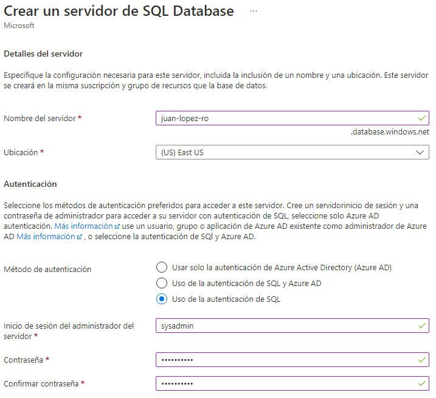

Luego configuramos el proceso y almacenamiento del server y lo dejamos en la configuración "básica":
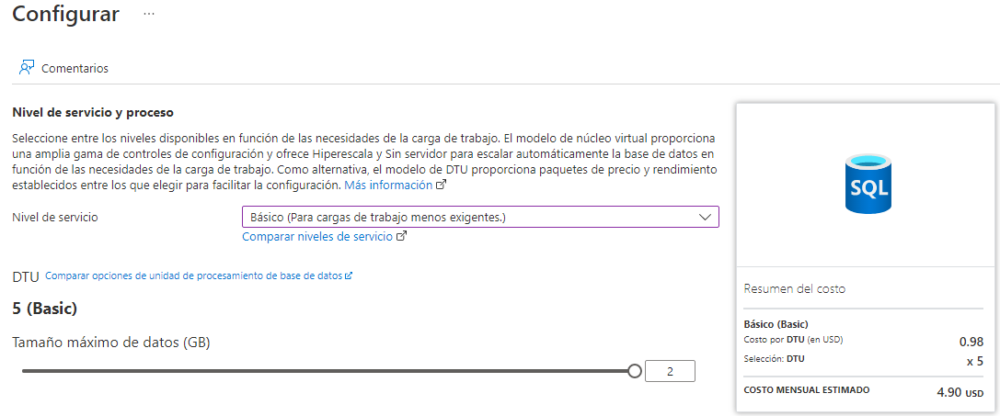

Una vez queda hecho esto solo hace falta darle al botón "Revisar y crear" y esperar a que el recurso termine de crearse.

### Creación servicios de app
Volvemos al [Portal Azure](https://portal.azure.com/#home) y le damos nuevamente al botón "Crear un recurso", pero esta vez buscamos "App services". Llegamos a la página de creación y le damos a "Crear":
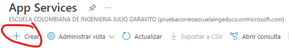

Una vez en la página de creación de aplicación web, ingresamos los datos básicos similares a los de la base de datos. Ingresamos la misma suscripción de Azure, así como el mismo grupo de recursos. Ingresamos un nombre personalizado para el recurso y seleccionamos que la pila del entorno en tiempo de ejecución sea "ASP.NET V4.8":
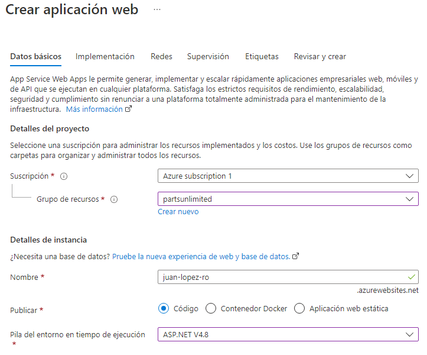

A la hora de configurar el "Plan de App Service" hay que crear un nuevo plan llamado "plan":
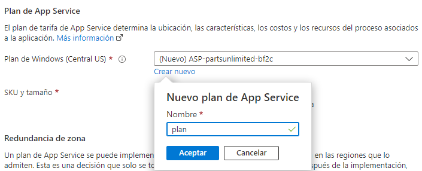

Ya hecho esto solo hace falta darle a "Revisar y crear" y esperar a que esté hecho el recurso.

A continuación creamos otro recurso idéntico al app service que acabamos de crear solo que este se debe llamar "juan-lopez-ro-prod": \
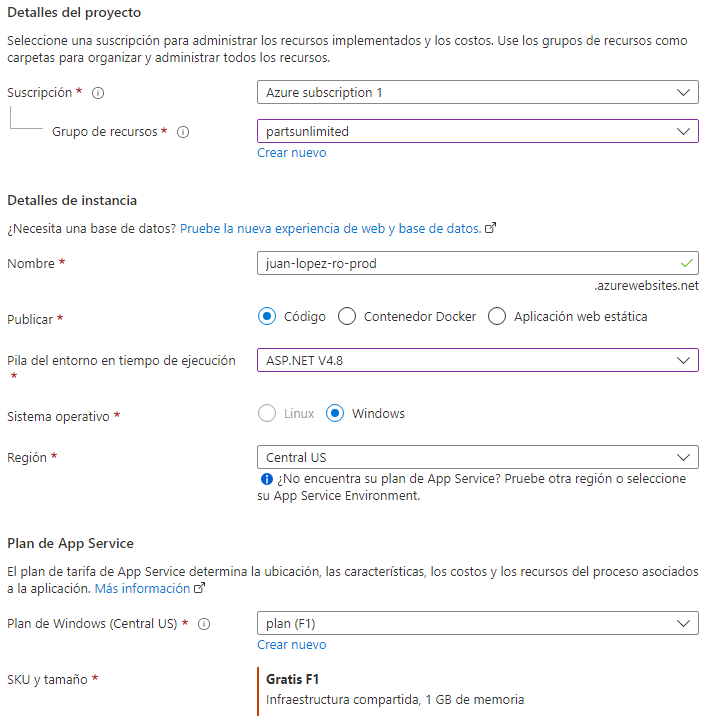

## Creación de un release continuo a la etapa QA
Para toda esta sección se debe ir inicialmente al portal de [Azure DevOps](https://dev.azure.com/juanlopez-ro/Parts%20Unlimited) con el proyecto ya iniciado de "Parts Unlimited". Una vez ya en este portal, se debe ir a la sección de "Pipelines" y luego a "Releases". Aquí se debe eliminar el release actual que se tiene por default: \
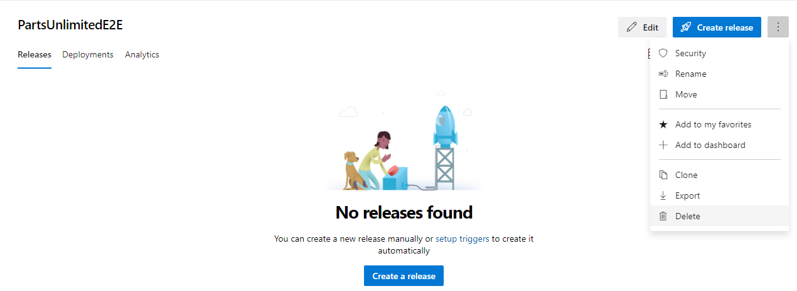

Ya borrado el release default creamos uno nuevo con el botón "New pipeline". Y seleccionamos el modelo de "Azure App Service deployment": \
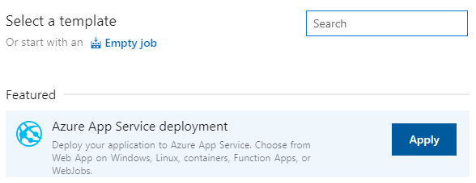

Le ponemos el nombre de "QA" al stage que está por default, y también le cambiamos el nombre al release del pipeline a "PUL-CICD": \
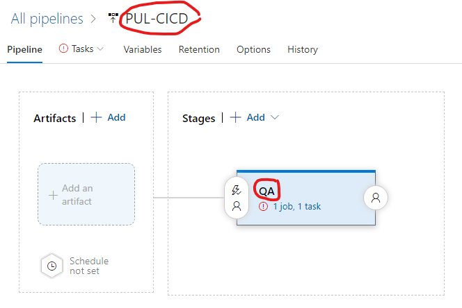

Ahora añadimos el artefacto a ser desplegado. En la sección "Artifacts" le damos a "Add" y a la hora de configurarlo damos los siguientes datos: \
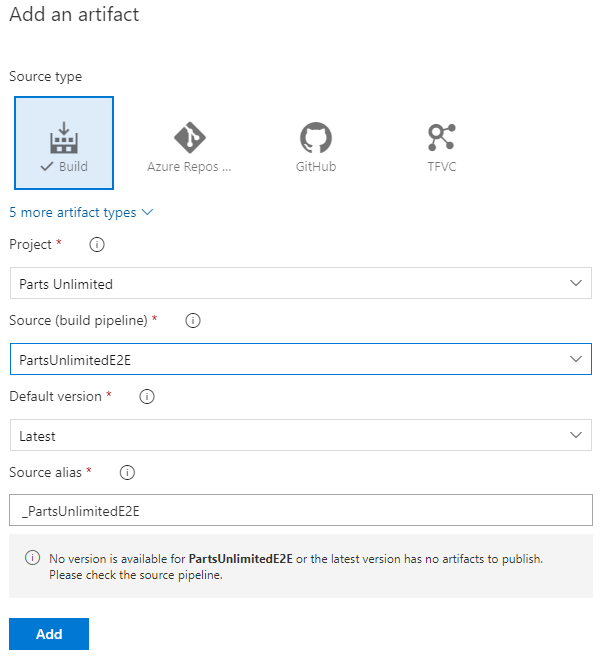

Al configurar el despliegue de QA hay que seleccionar la opción "1 job, 1 task". Seleccionamos la suscripción requerida, le damos a "Authorize" y en el nombre del app service le ponemos el que habíamos creado al configurar el servicio (juan-lopez-ro-qa):
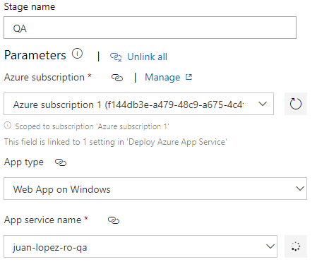

Volvemos a "Pipeline" y le damos clic al icono de relámpago (deployment trigger) que hay sobre el artefacto que configuramos previamente. Activamos el trigger de despliegue continuo y le añadimos un "build branch filter" (el que está por default):
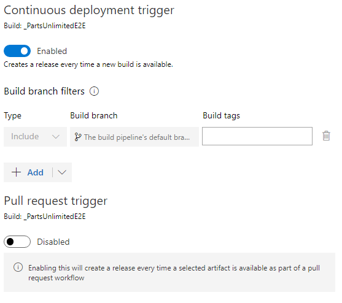

Y para finalizar esta creación del release continuo guardamos el progreso realizado.

## Configuración de los servicios de aplicación Azure
Para esta sección volvemos al [Portal Azure](https://portal.azure.com/#home) y volvemos al área de grupos de recursos y entramos al grupo que creamos previamente. En el grupo ingresamos a la base de datos SQL creada y le damos clic a la opción "Mostrar las cadenas de conexión de la base de datos". Copiamos la cadena de ADO.NET para poder configurar el sitio web que estamos creando. \
Ahora volvemos al grupo de recursos y entramos al servicio de app de qa creado previamente (juan-lopez-ro-qa) y una vez ahí, entramos a "Configuración" donde crearemos una nueva cadena de conexión dándole al botón "Nueva cadena de conexión" e ingresando los siguientes datos: \
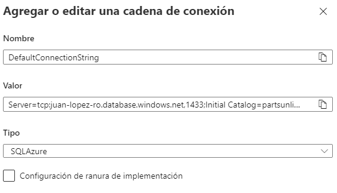

Hay que dejar claro que en la ranura de "valor" se debe copiar la cadena de conexión obtenida previamente solo que con la contraseña establecida especificada en el espacio "Password={your_password}" de la cadena.

Guardamos el progreso con el botón "Guardar" y pasamos al siguiente paso.

## Invocación del release continuo a QA
Hay que volver a la página de [Azure DevOps](https://dev.azure.com/juanlopez-ro/Parts%20Unlimited) e ingresar al proyecto actual. Una vez ahí hay que ingresar a los repositorios del proyecto, y ahí ingresamos al archivo "_Layout.cshtml":
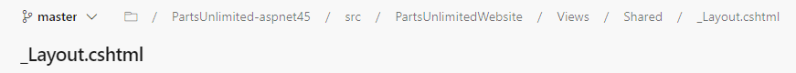

En este archivo cambiaremos una imagen, ingresándole un texto adicional. Para esto le damos al botón "Edit" en la parte superior para ingresar a una vista que permita la edición del texto, y una vez hecho el cambio hacemos commit con el botón "Commit".

Luego de esto volvemos a la sección de "Pipelines" a revisar si esta se está ejecutando correctamente:
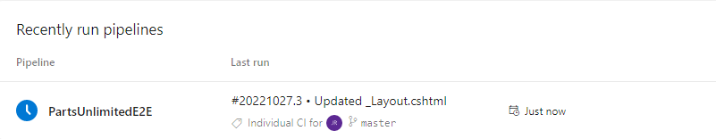

Ya podemos revisar el despliegue llendo al link del [artefacto](https://juan-lopez-ro-qa.azurewebsites.net) (página web).